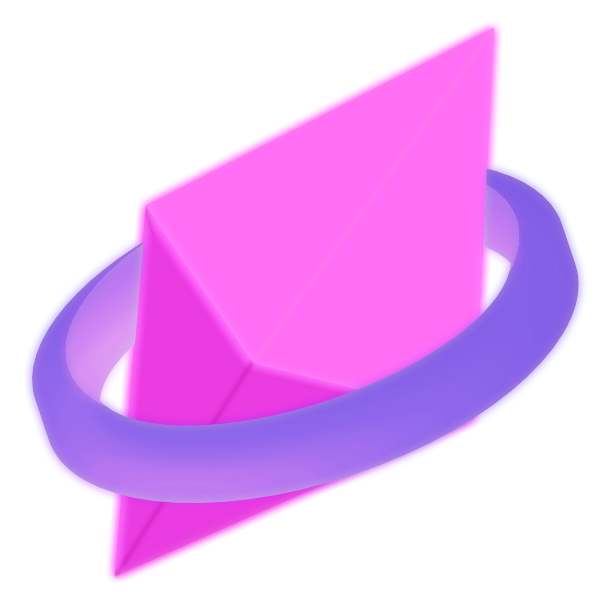

<html>
    

        
    

    <h1 align="center">Blamite</h1>
    

       Open source recreation of the Halo Custom Edition Dedicated Server
    

    
&nbsp;

</html>

This project is looking to recreate the entire dedicated server functionality for Halo Custom
Edition in order to start taking the first steps into an open source alternative codebase for the
game, main goal for now is to be able to fully communicate and host a game server using the code
in this repository, a game engine implementation will be faked on the meanwhile.

# Contributing
We are desesperately looking for contributors for the project, the expectations are really high
so serious development is expected, any help will be appreciated.

Knowledge, skills required or preferred:
- Assembly x86
- C
- C++
- CMake
- Lua
- Networking
- Data structures
- Willing to make cool stuff!

# Community
Join us on our [Discord server](https://discord.shadowmods.net) if you want to discuss and see our
other projects.